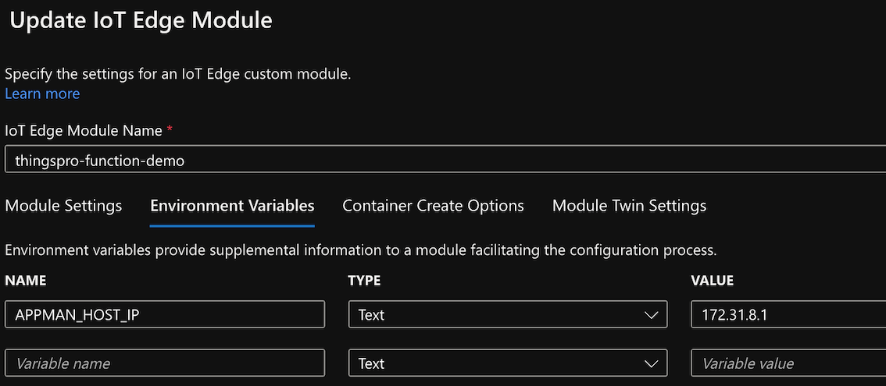
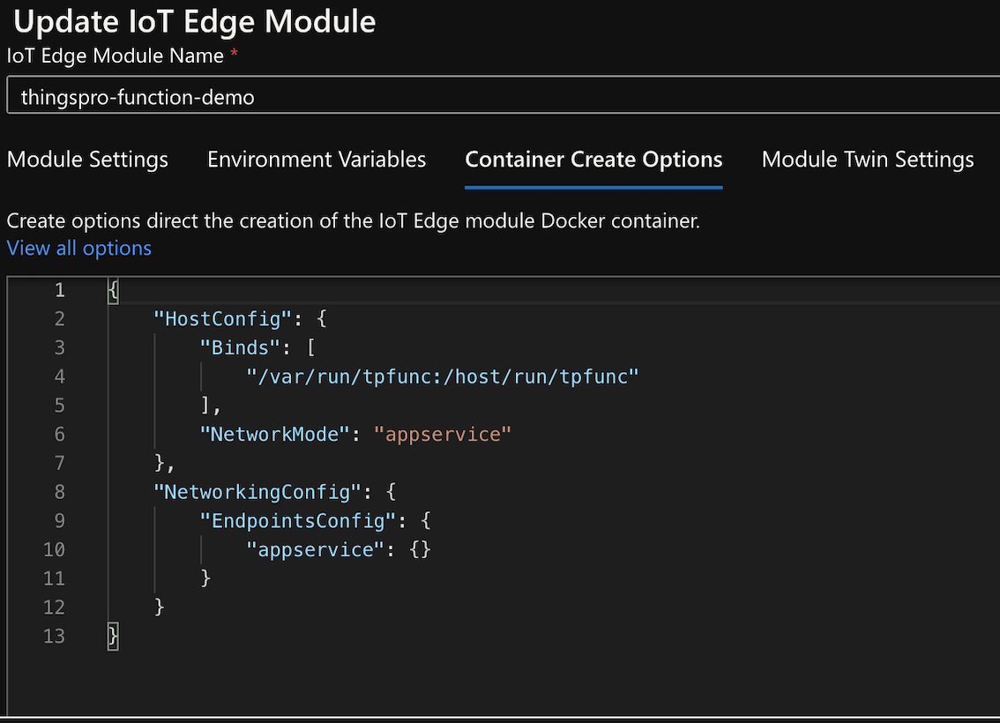

# Run your function as a AzureIoTEdge Module

Azure IoT Edge becomes more popular for people selecting their edge platform. Therefore, since the beginning version of ThingsPro Edge, we have integrated Azure IoT Edge and IoT Device as a very important feature of us. On top of that, we are still considering how do users not only develop AIE modules but also are able to have connection with ThingsPro Edge.  

In [Run your function from a standalone container](../standalone), we learned building a standalone container with Edge Function SDK. Based on it, we are going to demonstrate how to deploy an Edge Function module with ThingsPro Edge environment settings.

1. First of all, take a walk with the tutorial of [Deploy Azure IoT Edge modules from the Azure portal](https://docs.microsoft.com/en-us/azure/iot-edge/how-to-deploy-modules-portal?view=iotedge-2020-11#select-device-and-add-modules).
2. Create a module from your IoT Hub.
3. Enter `Update IoT Edge Module` page.
4. Add env `APPMAN_HOST_IP`.
 
5. Switch tab to `Container Create Options` and edit networking settings.
 
6. Update and deploy module.
